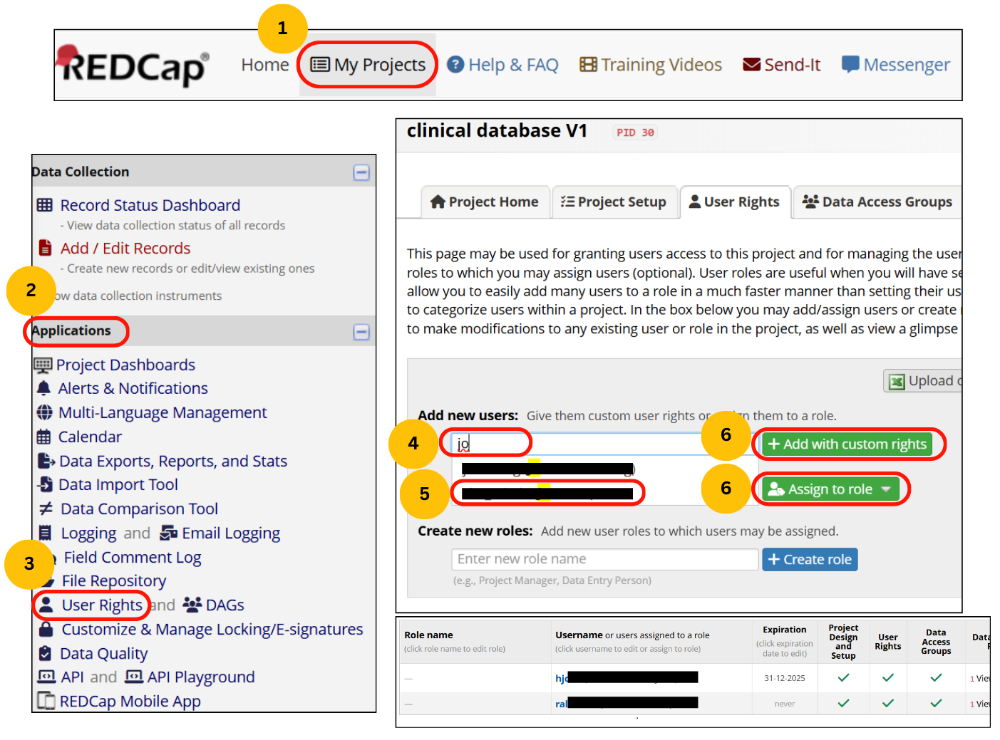
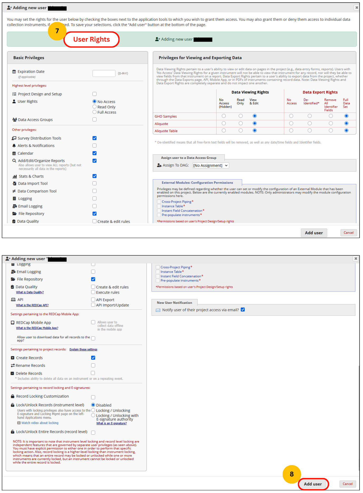

### Steps
1.	Log in and go to the **My Projects** tab on the navigation panel.
2.	Go to your desired projects in **My Projects**. 
3.	On the left side navigation panel, go to the **User Rights** module under **Applications**.
4.	To add a new User, write the username or email ID and select the user from the drop-down list.
5.	You may add the user with custom rights, in which you will have to check for permissions for all the modules; otherwise, you may directly add the user by assigning a role option and using pre-defined roles as created before. Nonetheless, there is always the option to modify and update rights along with roles.

### Graphical steps
{align="center" }

{align="center" }

### Video

    <iframe
        src="https://www.youtube.com/embed/_XAI8awxYzM">
    </iframe>

