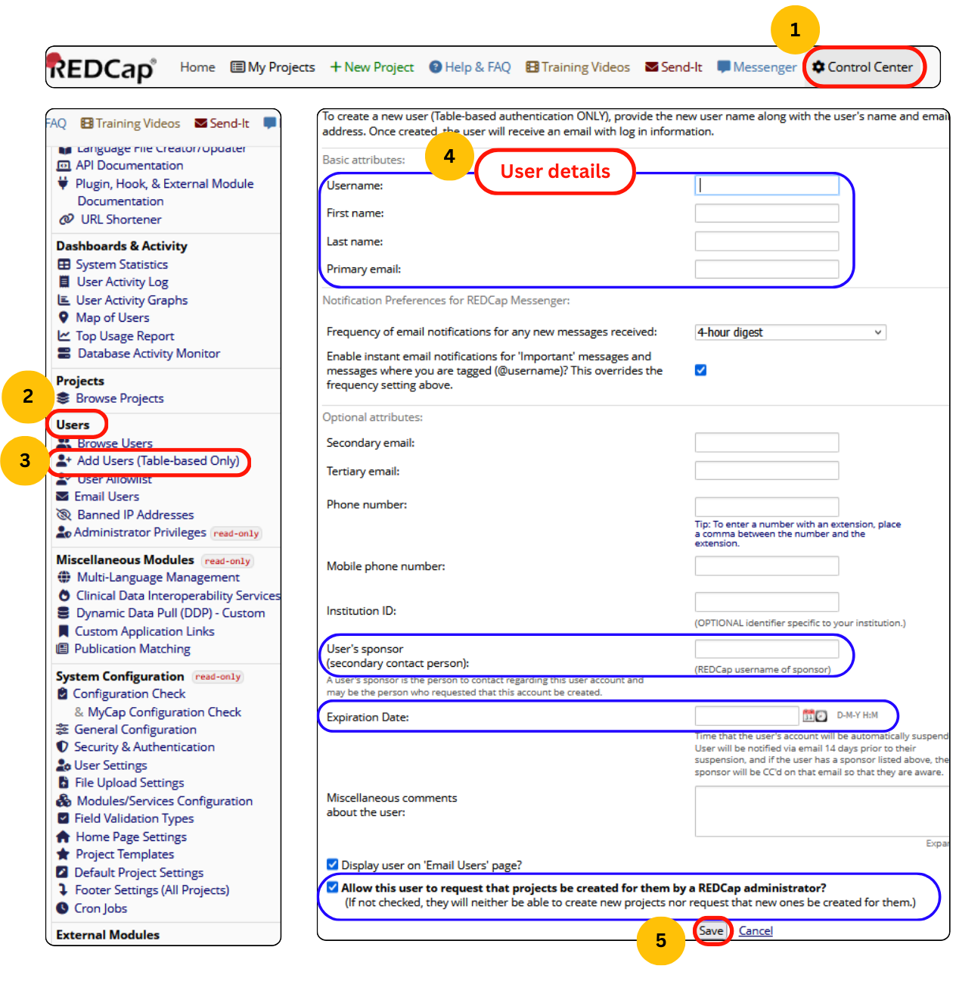

## Create New User

1.	Use the top navigation panel to reach **Control Center**.

    !!! note
        Only users with **admin rights** can create new users.

2.	On the left side navigation panel, go to the **Add Users (Table-based only)**.
3.	Fill in the details with a desired username (better to use the format in the email ID itself), the primary email will be the institutional email.
4.	Kindly, add the user account creator (the person who created the account for the new user) email address in the **User’s sponsor** input area.
5.	Make sure to fill in the **Expiration Date** for the new user if the person's period of work is already defined.

    !!! tip
        Uncheck the last option to **Allow this user request that projects be created for them by a REDCap administrator**, if you are going to manage the creation and design of the project.

<figure markdown="span">
  {align="center" }
  <figcaption>Add new user steps</figcaption>
</figure>

    <iframe width="720" height="540"
        src="https://www.youtube.com/embed/2uVlyb0irV0">
    </iframe>

