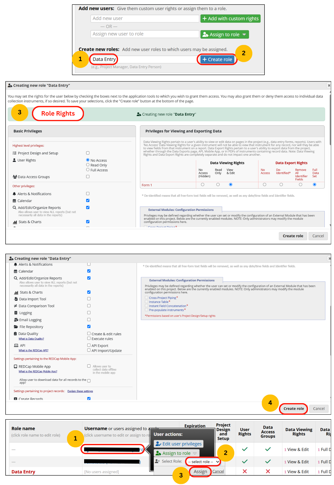

### Steps
1.	Default setting for new user:
    1.	Allowed
        -	Yes: Calendar, File Repository, Graphical Data view and Stats, Reports & Report Builder
        -	Data Export Tool (De-identified)
        -	Lock\Unlock reports disabled
        -	Create records
    2.	Not Allowed
        -	Rename records, Delete Records
        -	API, Data Import, Data Comparison
        -	Logging, User Rights, Data Access Groups
        -	Data Quality (create and edit rules) 
        -	Project Design and Setup
2.	Important Points
    1.	Set Expiration date (if applicable)
    2.	Check and update Data Entry Rights (View & Edit by default)
    3.	Limit the default settings further to have guest users or make a DAG for them
3. Further customization may be done based on project-to-project requirements.

### Graphical steps
{align="center" }

!!! tip
    Besides individual customisation, it is better to use **Custom Role** to set users in their special profiles, such as guest, data entry, project admin, statistician/analyst, principal investigator, with pre-defined user rights.

### References
1.	[https://cri.uchicago.edu/wp-content/uploads/2015/12/REDCap-User-Rights-Best-Practices.pdf](https://cri.uchicago.edu/wp-content/uploads/2015/12/REDCap-User-Rights-Best-Practices.pdf)
2.	[https://www.ctsi.ufl.edu/files/2017/06/User-Rights-Guidance-Document.pdf](https://www.ctsi.ufl.edu/files/2017/06/User-Rights-Guidance-Document.pdf)
3.	[https://ws.engr.illinois.edu/sitemanager/getfile.asp?id=1359](https://ws.engr.illinois.edu/sitemanager/getfile.asp?id=1359)